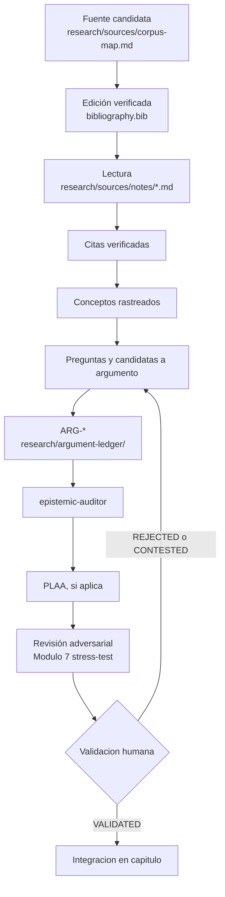
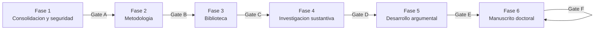

# Master Execution Plan (MEP)

**Estado:** aprobado por el investigador (2026-08-08).
**Autoridad:** [`governance/authority-policy.md`](governance/authority-policy.md)
(DEC-004). Solo Juan Pablo Valderrama Pino (VladPhil92) puede declarar
satisfecha una puerta de decisión (`Decision Gate`) o avanzar de fase.

Este documento es la hoja de ruta ejecutiva del repositorio: qué debe
hacerse, en qué orden, bajo qué condiciones, con qué entregables, cómo se
mide el progreso y qué constituye el cierre de cada fase. No sustituye
`CLAUDE.md`, `research/methodology.md`, `governance/provenance.md` ni
`ai/policy.md` — los reutiliza y enlaza. No contiene fechas ni plazos: mide
progreso por criterios verificables, no por calendario.

## Principio ejecutivo

El repositorio existe para sostener la investigación. La investigación no
existe para justificar el desarrollo del repositorio. Ante cualquier
tensión entre infraestructura e investigación, **la investigación tiene
prioridad**. Ningún cambio de infraestructura se ejecuta sin una necesidad
de investigación real que lo motive (`governance/decision-log.md`, DEC-003).

Todo elemento de este plan debe superar una pregunta: *¿aumenta la
probabilidad de que esta investigación doctoral se complete con mayor
rigor académico, transparencia, reproducibilidad y mantenibilidad a largo
plazo?* Si la respuesta es no, no se implementa.

## Dónde estamos ahora (2026-08-08)

Evaluación honesta contra el modelo de madurez (sección siguiente), no
aspiracional:

- **Nivel alcanzado: 2** (fuentes registradas y leídas). Dos fuentes en
  `bibliography.bib` con edición verificada y ficha en
  `research/sources/notes/`: `SRC-004` (Derrida, *The Animal That
  Therefore I Am*, 58 citas cotejadas) y `SRC-002` (Derrida, *Hospitality,
  Volume I*, 9 citas cotejadas — la de conexión más directa con `PI-01`
  hasta ahora).
- **Nivel 3 (argumentos producidos) todavía no alcanzado**: cero fichas en
  `research/argument-ledger/` más allá del `README.md`. Candidatas ya
  identificadas: distinción dominio/nombrar y límite de la hospitalidad
  levinasiana (`derrida-2008-animal.md`); la aporía ley/leyes de la
  hospitalidad y la coimplicación soberanía/hospitalidad vía ipseidad
  (`derrida-2023-hospitality.md`, esta última la más madura). Ningún
  `ARG-*` construido todavía.
- **Gate A (Repository Ready) cruzada** (2026-08-08, DEC-006): Fase 1
  cerrada, incluida la protección de `main`.
- Fase activa: **Fase 4 (Investigación sustantiva)**, con la Fase 3
  (Biblioteca de investigación) todavía abierta en paralelo — el corpus se
  construye de forma progresiva, no por lote.
- Puerta más próxima a cruzar: **Gate D (Research Ready)**, no antes de
  tener 3–5 fuentes en Nivel 2, no solo una.

## Modelo de madurez de investigación

Cada nivel exige que el anterior siga cumplido; no son etapas que se
abandonan, son capas que se sostienen.

| Nivel | Nombre | Criterio verificable |
|---|---|---|
| 0 | Solo infraestructura | Arquitectura congelada (DEC-001/002/003), `CLAUDE.md` y auditoría en verde, cero entradas reales en `bibliography.bib`, cero `ARG-*`. |
| 1 | Fuentes registradas | ≥1 entrada en `bibliography.bib` con edición verificada (ISBN/DOI/traductor/editorial confirmados, no candidata) y su ficha correspondiente en `research/sources/notes/`. |
| 2 | Fuentes leídas | ≥1 ficha con `Referencia verificada: sí`, sección «Citas verificadas» no trivial, y «Paráfrasis e interpretación» poblada con lectura crítica real. |
| 3 | Argumentos producidos | ≥1 `ARG-*` en `research/argument-ledger/` con `status` ≥ `DEVELOPING`, afirmación y premisas redactadas (no la plantilla vacía). |
| 4 | Argumentos validados | ≥1 `ARG-*` con `status: VALIDATED` y `human_validation: validated`, habiendo pasado por `epistemic-auditor` y, si aplica, PLAA, con hallazgos registrados. |
| 5 | Capítulos integrados | ≥1 archivo en `thesis/chapters/` no vacío que cite explícitamente ≥1 `ARG-*` en estado `VALIDATED`. |
| 6 | Manuscrito doctoral | Todos los capítulos de `thesis/outline.md` (una vez ratificado) redactados, integrados y en revisión final. |

Este modelo no crea identificadores nuevos: es una lectura agregada de los
estados que `templates/ficha-fuente.md`, `research/sources/corpus-map.md`
y `templates/ficha-argumento.md` ya registran. Calcularlo hoy es manual
(contar fichas y estados); automatizarlo con un script solo se justifica
cuando el volumen lo requiera, siguiendo el mismo criterio que
`ai/plaa/ROADMAP.md` aplica a su propia infraestructura.

## Las seis fases

### Fase 1 — Consolidación y seguridad del repositorio

- **Objetivo ejecutivo:** que la infraestructura documental y de gobernanza
  sea estable, auditable y no requiera más decisiones estructurales
  recurrentes.
- **Alcance:** arquitectura, autoridad, gobernanza, protección de la rama
  principal, estabilidad del flujo de trabajo de Git/CI.
- **Dependencias:** ninguna — es la base.
- **Entregables:**
  - Arquitectura congelada — `governance/decision-log.md` DEC-001, DEC-002,
    DEC-003. **Hecho.**
  - Política de autoridad del repositorio —
    `governance/authority-policy.md`, DEC-004. **Hecho.**
  - Configuración de Claude Code (`CLAUDE.md`, `.claude/rules/`,
    `.claude/agents/epistemic-auditor.md`). **Hecho.**
  - Auditoría automatizada (`scripts/auditar_repositorio.py`,
    `.github/workflows/auditoria.yml`) verificando invariantes
    documentales. **Hecho.**
  - Rama `main` protegida contra force-push y borrado, coherente con
    `governance/authority-policy.md`. **Hecho** (DEC-006,
    `governance/decision-log.md`): `allow_force_pushes: false`,
    `allow_deletions: false`; sin exigencia de PR ni de CI antes de
    fusionar, para no introducir fricción sobre el flujo del investigador.
  - Checklist de seguridad (secretos, material protegido fuera de
    versión, `.gitignore` sin agujeros). **Hecho** (incluida la corrección
    del agujero en `research/sources/` detectada en esta sesión).
- **Riesgos:** cambiar configuración de GitHub sin acuerdo explícito puede
  bloquear al propio investigador; un `.gitignore` demasiado agresivo puede
  volver a ocultar rutas legítimas sin que nadie lo note.
- **Indicadores de éxito:** `python3 scripts/auditar_repositorio.py` en
  verde de forma sostenida; cero ramas de PR históricas sin clasificar;
  `git status --short --ignored` sin sorpresas.
- **Checklist de cierre:**
  - [x] Arquitectura congelada y documentada.
  - [x] Autoridad formalizada.
  - [x] Auditoría automatizada en verde.
  - [x] `main` protegida según reglas acordadas explícitamente (DEC-006).
- **Madurez estimada:** operativa. Fase 1 cerrada — **Gate A cruzada**
  (2026-08-08).

### Fase 2 — Metodología de investigación

- **Objetivo ejecutivo:** que el método filosófico pueda ejecutarse sin
  ambigüedad — cualquier sesión (humana o de IA) sabe qué se espera al
  leer, citar, formalizar o construir un argumento.
- **Alcance:** las diez decisiones ya enumeradas en
  `research/methodology.md` (método filosófico general, selección del
  corpus, fuentes primarias/secundarias, procedimiento de lectura cercana,
  disputas de interpretación, traducciones, verificación de citas, papel
  de las objeciones, papel de la IA, límites metodológicos).
- **Dependencias:** Fase 1 (Gate A).
- **Entregables:** `research/methodology.md` con cada sección cerrada por
  el investigador, con fecha, en vez de marcada `DECISIÓN HUMANA
  REQUERIDA`.
- **Riesgos:** decidir el método por conjetura o plausibilidad filosófica
  en vez de por elección real del investigador (prohibido explícitamente
  en `CLAUDE.md` y en `research/methodology.md`, «Regla de cierre»);
  cerrar la metodología prematuramente y tener que revisarla después de
  construir varios argumentos sobre una base distinta.
- **Indicadores de éxito:** cero secciones marcadas `DECISIÓN HUMANA
  REQUERIDA` en `research/methodology.md` para las decisiones que ya
  bloquean trabajo activo (§2 selección de corpus, §6 traducciones son las
  más urgentes hoy, dado el trabajo ya en curso sobre Derrida).
- **Checklist de cierre:**
  - [ ] §1 Método filosófico general decidido.
  - [ ] §2 Criterios de selección del corpus decididos.
  - [ ] §3 Regla primaria/secundaria decidida.
  - [ ] §4 Procedimiento de lectura cercana decidido.
  - [ ] §5 Tratamiento de disputas de interpretación decidido.
  - [ ] §6 Tratamiento de traducciones decidido (**urgente**: ya afecta a
        `research/sources/notes/derrida-2008-animal.md`).
  - [x] §7 Verificación de citas — regla operativa mínima ya vigente
        (`RESEARCH-WORKFLOW.md`, `.claude/rules/sources.md`); detalle fino
        pendiente.
  - [ ] §8 Papel de las objeciones decidido.
  - [x] §9 Papel de la IA — regulado por `ai/policy.md` y
        `AI-RESEARCH-PROTOCOL.md`; detalle de tareas delegables pendiente.
  - [ ] §10 Límites metodológicos declarados.
- **Madurez estimada:** parcial — puede avanzar en paralelo con la Fase 3
  y la Fase 4 a pequeña escala (como ya ocurrió con la primera fuente),
  pero no debe escalar el corpus completo sin cerrar §2 y §6.

### Fase 3 — Biblioteca de investigación

- **Objetivo ejecutivo:** que exista un primer corpus real, verificado y
  correctamente separado entre material privado y conocimiento
  versionado.
- **Alcance:** separar la **capa de fuentes privadas** (originales,
  PDF, OCR — locales, excluidos de Git por `.gitignore`) de la **capa de
  conocimiento de investigación versionada** (`bibliography.bib`,
  `research/sources/notes/`, `research/sources/corpus-map.md`).
- **Dependencias:** Fase 1 (Gate A). No depende de cerrar toda la Fase 2,
  pero sí de tener al menos una decisión provisional sobre traducciones
  antes de citar en volumen.
- **Entregables:**
  - `research/sources/bibliography.bib` con entradas de edición
    verificada. **1 de N — Derrida 2008.**
  - `research/sources/corpus-map.md`: 200 candidatos clasificados y
    priorizados. **Hecho** (es un mapa de candidatos, no de fuentes
    incorporadas).
  - Flujo de lectura documentado (`RESEARCH-WORKFLOW.md`,
    `templates/ficha-fuente.md`). **Hecho.**
  - Ediciones verificadas para cada fuente que pase de `CANDIDATE` a
    `CITED`. **En curso.**
- **Riesgos:** recrear fichas especulativas para obras no incorporadas
  realmente (ya identificado como error en las ramas de PR históricas #2
  y #9, DEC-003); mezclar material privado con la capa versionada.
- **Indicadores de éxito:** proporción de candidatos `PRIORIDAD: ALTA` que
  avanzan de `CANDIDATE`/`IDENTITY_VERIFIED` a `CITED`; cero fichas
  especulativas para obras no adquiridas.
- **Checklist de cierre (primer corpus, no el corpus completo):**
  - [x] Al menos 1 fuente `PRIORIDAD: ALTA` en estado `CITED`.
  - [ ] Al menos 3–5 fuentes `PRIORIDAD: ALTA` en estado `CITED` (umbral
        sugerido de Gate D, no obligatorio antes).
  - [x] Convención de estados y clasificación funcional documentada.
- **Madurez estimada:** iniciada, progresiva por diseño — nunca "completa"
  de una vez; se abre y se sostiene durante toda la investigación.

### Fase 4 — Investigación sustantiva

- **Objetivo ejecutivo:** producir conocimiento verificado: notas de
  lectura, citas cotejadas, conceptos rastreados, preguntas abiertas y
  argumentos candidatos.
- **Alcance:** el flujo fuente → lectura → notas → citas verificadas →
  conceptos → preguntas → argumentos potenciales, tal como ya se ejecutó
  para `derrida-2008-animal.md`.
- **Dependencias:** Fase 3 (al menos una fuente en `CITED`).
- **Entregables:** fichas de fuente pobladas (`research/sources/notes/`),
  registros de IA cuando corresponda (`ai/log/`).
- **Riesgos:** volumen de citas que crece más rápido que la verificación
  humana real (mitigado en esta sesión con control cruzado por búsqueda
  cuando el volumen lo justificó); confundir síntesis asistida por IA con
  evidencia.
- **Indicadores de éxito:** citas verificadas por fuente; fichas con
  «Paráfrasis e interpretación» sustantiva, no solo metadatos; candidatas
  a argumento explícitamente señaladas en «Tareas pendientes» de cada
  ficha.
- **Checklist de cierre (para declarar Gate D):**
  - [x] Al menos 1 fuente con lectura crítica profunda.
  - [ ] Al menos 3–5 fuentes con lectura crítica profunda y candidatas a
        argumento identificadas.
  - [ ] Al menos 2 conceptos centrales (p. ej. soberanía, hospitalidad)
        con apariciones rastreadas en más de una fuente — insumo directo
        para el Módulo 6 de PLAA cuando haya suficiente material.
- **Madurez estimada:** en curso, un ciclo completo ya ejecutado.

### Fase 5 — Desarrollo argumental

- **Objetivo ejecutivo:** transformar evidencia ya verificada en
  argumentos con premisas, inferencia, objeciones y estado epistémico
  explícito.
- **Alcance:** evidencia → `ARG-*` → `epistemic-auditor` → PLAA (módulos
  aplicables) → revisión adversarial → validación humana. Reutiliza
  exactamente `templates/ficha-argumento.md`,
  `.claude/agents/epistemic-auditor.md` y `ai/plaa/`; no crea agentes
  nuevos.
- **Dependencias:** Fase 4 (Gate D) y Fase 2 §8 (papel de las objeciones)
  al menos decidida de forma provisional.
- **Entregables:** fichas `ARG-*` en `research/argument-ledger/`,
  informes de auditoría (del `epistemic-auditor` y, cuando corresponda,
  de PLAA), `research/argument-map.md` actualizado con relaciones reales.
- **Riesgos:** construir un argumento sin objeción seria (contradice la
  «Regla de promoción» implícita en el propio ciclo de estados); que un
  informe de auditoría se trate como si validara el argumento — ningún
  informe de `epistemic-auditor` ni de PLAA puede escribir `VALIDATED`
  (`.claude/agents/epistemic-auditor.md`, `ai/plaa/prompts/00-core-principles.md`).
- **Indicadores de éxito:** argumentos por estado
  (`IDEA`/`DEVELOPING`/`SUPPORTED`/`CONTESTED`/`READY_FOR_HUMAN_REVIEW`/
  `VALIDATED`/`REJECTED`); objeciones abiertas vs. resueltas por
  argumento.
- **Checklist de cierre (para declarar Gate E):**
  - [ ] Al menos 1 `ARG-*` en estado `VALIDATED` con `human_validation:
        validated` explícito del investigador.
  - [ ] Ese `ARG-*` tiene al menos una objeción seria documentada y
        respondida.
  - [ ] Auditoría de `epistemic-auditor` ejecutada y registrada para ese
        argumento.
- **Madurez estimada:** no iniciada — primer candidato natural: la
  distinción dominio/nombrar o el límite de la hospitalidad levinasiana,
  ambas señaladas en `research/sources/notes/derrida-2008-animal.md`.

### Fase 6 — Manuscrito doctoral

- **Objetivo ejecutivo:** redactar capítulos que integren exclusivamente
  argumentos ya validados.
- **Alcance:** `ARG-*` validado → borrador de capítulo → revisión →
  observaciones del director/supervisor → control de versiones. Solo
  argumentos `VALIDATED` pueden entrar a `thesis/chapters/`
  (`CLAUDE.md`, «Regla argumental»).
- **Dependencias:** Fase 5 (Gate E) y `thesis/outline.md` ratificado (hoy
  marcado `PENDIENTE`, ver Fase 2 §1).
- **Entregables:** capítulos en `thesis/chapters/`, observaciones en
  `thesis/review/`.
- **Riesgos:** redactar prosa capitular sobre un argumento todavía
  `DEVELOPING`; que la escritura presione a validar argumentos antes de
  tiempo — el principio ejecutivo de este documento existe precisamente
  para resistir esa presión.
- **Indicadores de éxito:** proporción de secciones de
  `thesis/outline.md` con al menos un `ARG-*` `VALIDATED` que las respalde
  antes de escribirse.
- **Checklist de cierre (para declarar Gate F, apertura de escritura
  activa):**
  - [ ] `thesis/outline.md` ratificado por el investigador (deja de decir
        `PENDIENTE`).
  - [ ] Mapa explícito de qué `ARG-*` valida respalda cada sección
        prevista.
  - [ ] Al menos un capítulo con argumentos suficientes para un primer
        borrador completo.
- **Madurez estimada:** no iniciada.

## Puertas de decisión (Decision Gates)

Ninguna puerta se declara satisfecha por un script, un agente o una
sesión de Claude Code. Cada una requiere una entrada fechada y firmada por
Juan Pablo Valderrama Pino en `governance/decision-log.md`
(`governance/authority-policy.md`, DEC-004), citando explícitamente qué
puerta se cruza y por qué.

| Puerta | Nombre | Habilita | Criterio mínimo |
|---|---|---|---|
| A | Repository Ready | Fase 2 a escala | Fase 1 cerrada, incluida la decisión sobre protección de `main`. |
| B | Methodology Approved | Fase 3/4 a escala completa | `research/methodology.md` §2 y §6 cerradas como mínimo (las que ya bloquean trabajo activo); el resto puede seguir abierto si no bloquea. |
| C | Corpus Ready | Fase 5 a escala | 3–5 fuentes `PRIORIDAD: ALTA` en `CITED`, con lectura crítica de nivel 2. |
| D | Research Ready | Construcción activa de `ARG-*` | Checklist de cierre de Fase 4 completo. |
| E | Argument Ready | Fase 6 (redacción activa) | Checklist de cierre de Fase 5 completo: ≥1 `ARG-*` `VALIDATED`. |
| F | Writing Ready | Integración capitular a escala | `thesis/outline.md` ratificado y mapeado a argumentos validados. |

Cruzar una puerta antes de tiempo no es una falta grave si es deliberado y
declarado (p. ej. investigar una fuente aislada antes de cerrar toda la
metodología, como ya ocurrió). Lo que este documento prohíbe es cruzarla
**en silencio**, sin que quede registrado que fue una decisión y no un
descuido.

## KPIs (especificación, no dashboard automatizado)

No se construye una aplicación ni un script nuevo para calcular esto: los
números se cuentan manualmente contra los archivos existentes hasta que el
volumen lo justifique (mismo criterio que `ai/plaa/ROADMAP.md`). Formato
sugerido de tabla para `templates/revision-mensual.md`:

| Indicador | Cómo se cuenta | Prioriza calidad sobre cantidad |
|---|---|---|
| Fuentes candidatas | Filas de `research/sources/corpus-map.md` | Referencia de contexto, no meta. |
| Fuentes registradas (`bibliography.bib`) | Entradas `@...{...}` reales | — |
| Fuentes leídas (Nivel 2) | Fichas con «Citas verificadas» no trivial | Prioriza profundidad de lectura por fuente sobre número de fuentes tocadas. |
| Citas verificadas | Citas listadas en fichas de `research/sources/notes/` | Nunca meta de por sí — una cita mal verificada vale menos que cero. |
| Notas de investigación | Fichas en `research/sources/notes/` | — |
| Registros conceptuales | Entradas futuras del Módulo 6 de PLAA (`concept-consistency.md`), cuando existan | — |
| Argumentos (`ARG-*`) por estado | Conteo de `status` en `research/argument-ledger/*.md` | El objetivo no es maximizar `ARG-*` en `IDEA`: un argumento sin desarrollar no cuenta como progreso real. |
| Argumentos validados | `status: VALIDATED` + `human_validation: validated` | Único indicador que realmente mueve el Nivel de madurez a 4. |
| Objeciones abiertas / resueltas | Sección «Objeciones y respuestas» de cada `ARG-*` | Objeciones abiertas no son un fallo: son honestidad epistémica. |
| Capítulos con integración real | Archivos no vacíos en `thesis/chapters/` que citan `ARG-*` `VALIDATED` | — |
| Cambios de infraestructura | Commits que tocan `scripts/`, `.claude/`, `ai/plaa/plaa/`, `governance/` | Se espera que baje con el tiempo (Fase 1 debe estabilizarse). |
| Intervenciones de IA | Archivos en `ai/log/` | No es una meta a maximizar; es transparencia, no productividad. |
| Validaciones humanas | Entradas con `human_validation: validated` en el tiempo | El único indicador que un agente de IA no puede mover. |

## Diagrama de ciclo de vida de la investigación (Fase 4–5)

## Diagrama de ciclo de vida del repositorio (Fases 1–6)

## Plantillas ejecutivas

No duplicadas aquí — viven en `templates/` junto al resto de plantillas
reutilizables del repositorio:

- [`templates/checklist-fase.md`](templates/checklist-fase.md) — checklist
  genérico de cierre de fase, instanciar una copia por fase revisada.
- [`templates/revision-semanal.md`](templates/revision-semanal.md) —
  flujo de trabajo semanal de investigación.
- [`templates/revision-mensual.md`](templates/revision-mensual.md) —
  revisión mensual con snapshot de KPIs.
- [`templates/revision-trimestral.md`](templates/revision-trimestral.md)
  — revisión estratégica trimestral: nivel de madurez, estado de puertas,
  ajustes de metodología o corpus.

Ninguna de estas plantillas es obligatoria por calendario: se usan cuando
el investigador decide revisar el progreso, no según un cronograma fijo
que este documento no establece.

## Gobernanza y reutilización

Este plan no crea una segunda política de IA, una segunda cadena de
procedencia ni una segunda autoridad. Reutiliza explícitamente:

- Autoridad exclusiva: [`governance/authority-policy.md`](governance/authority-policy.md).
- Procedencia: [`governance/provenance.md`](governance/provenance.md).
- Decisiones estructurales: [`governance/decision-log.md`](governance/decision-log.md).
- Reglas de IA: [`CLAUDE.md`](CLAUDE.md), [`ai/policy.md`](ai/policy.md),
  [`AI-RESEARCH-PROTOCOL.md`](AI-RESEARCH-PROTOCOL.md).
- Metodología sustantiva: [`research/methodology.md`](research/methodology.md).

La IA nunca es autora, nunca valida filosofía, nunca marca un argumento
como validado, nunca cambia la metodología de forma autónoma. La IA
apoya: organización, recuperación, análisis, auditoría, navegación y
documentación. El investigador conserva la autoridad final sobre cada
puerta de decisión de este plan.

## Criterios de finalización

El proyecto se considera completo cuando:

1. Todas las secciones de `thesis/outline.md` (ratificado en Gate F)
   tienen prosa capitular integrada en `thesis/chapters/`.
2. Cada afirmación sustantiva del manuscrito remonta, por la cadena de
   `governance/provenance.md`, a una fuente verificada y a un `ARG-*`
   `VALIDATED`.
3. `python3 scripts/auditar_repositorio.py` termina en verde sobre el
   estado final del repositorio.
4. El investigador declara el cierre explícitamente en
   `governance/decision-log.md`.

Ningún criterio de finalización depende de una fecha. Depende
exclusivamente de que la cadena de trazabilidad esté completa y de que el
investigador la valide.
