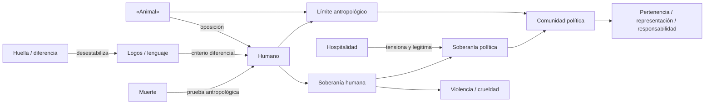

# Genealogía provisional de conceptos

> **AI-assisted historical reconstruction.** Este inventario no expresa la
> posición doctoral de Juan Pablo Valderrama Pino. «Primera aparición» designa
> el primer **momento documental que puede localizarse con los materiales
> disponibles**, no una página de la tesis. Como el ejemplar íntegro de 2020 no
> está almacenado en el repositorio, las apariciones internas y citas deben
> verificarse contra la fuente autorizada.

## Criterio de lectura

Se distinguen tres estaciones: **M** (tesis de maestría, 2020), **T**
(transición inferida) y **D** (formulación doctoral actual). La columna
«cambio» evita confundir continuidad léxica con identidad conceptual.

| Concepto | Primera aparición localizable | Evolución M → D | ¿Permanece igual? / modificación doctoral |
|---|---|---|---|
| **Animal** | M: aparece en el título, entre comillas y en singular general. | De objeto de crítica de una homogeneización a campo crítico para probar pertenencia política. | **No.** D conserva la crítica del singular, pero subordina la cuestión animal al problema de los límites políticos. |
| **Humano** | M: «soberanía humana» en el título. | De polo soberano opuesto al Animal a presupuesto antropológico de ciudadanía, representación y reconocimiento. | **No.** D pregunta por su función política, no solo metafísica. |
| **Logocentrismo** | M: pertenencia a la arquitectura reconstruida; primera página por verificar. | Vincula *logos*, voz, razón y privilegio humano; D examina sus efectos sobre representación y reciprocidad. | **Refuncionalizado.** No consta todavía como concepto rector de D. |
| **Soberanía** | M: título. | De atributo de lo humano a capacidad política de decidir, delimitar y producir pertenencia. | **Transformación mayor.** D ensaya su legitimación/autolimitación desde la hospitalidad. |
| **Hospitalidad** | T/D: aparece como novedad rectora del proyecto actual; una presencia en M no ha sido comprobada. | Introduce la tensión entre apertura incondicional y condiciones institucionales. | **Concepto nuevo o radicalmente promovido.** |
| **Violencia** | M: inferida como efecto de la oposición; ubicación por verificar. | De violencia de clasificación/exclusión a efectos de decisiones soberanas sobre seres afectados. | **Ampliada.** D exige justificar límites y revisar exclusiones. |
| **Crueldad** | M: concepto solicitado para la genealogía; primera ocurrencia por verificar. | Posible índice del daño que desmiente una diferencia basada únicamente en capacidades. En D no es eje canónico explícito. | **Pérdida de centralidad**, no abandono demostrado. |
| **Comunidad** | M: presencia textual por verificar. | De horizonte implícito de coexistencia a unidad que instituye límites y pertenencias. | **Politizada.** D la convierte en objeto explícito. |
| **Lenguaje** | M: concepto genealógico por verificar; ligado a la división humano/animal. | De criterio diferencial a problema de comparecencia, deliberación y representación no lingüística. | **No.** D desplaza la pregunta desde «tener lenguaje» hacia los sesgos de los mecanismos políticos. |
| **Diferencia** | M: concepto genealógico por verificar. | De desmontaje de una oposición binaria a pluralidad que impide fijar una frontera antropológica única. | **Retenida y pluralizada.** No equivale por sí misma a un principio normativo. |
| **Huella (trace)** | M: probable léxico deconstructivo; ocurrencia y traducción por verificar. | Desestabiliza presencia, propiedad y límite simple; en D funciona, como máximo, como trasfondo metodológico. | **Descentrada.** No figura como concepto rector actual. |
| **Muerte** | M: concepto solicitado; probable discusión del criterio «en cuanto tal», por verificar. | De marcador clásico de diferencia antropológica a posible dimensión de vulnerabilidad y vidas políticamente protegidas. | **Modificación hipotética.** El paso a vulnerabilidad no está validado como argumento doctoral. |
| **Comunidad política** | T/D: objeto explícito del título doctoral actual. | Convierte las consecuencias del límite antropológico en preguntas por membresía, institución y representación. | **Novedad de escala.** No es sinónimo de «comunidad» en M. |
| **Límite antropológico** | Implícito en M por la oposición del título; explícito en D. | De frontera humano/Animal a conjunto revisable de criterios que distribuyen relevancia política. | **Explicitado y operacionalizado** como sitio de prueba del proyecto. |

## Trayectorias agrupadas

### A. Núcleo retenido y transformado

`Animal ↔ humano → lenguaje/logos → diferencia → soberanía` forma el núcleo
histórico. El doctorado no lo reproduce intacto: intercala entre diferencia y
soberanía los problemas de pertenencia, representación y justificación.

### B. Vocabulario de diagnóstico que pierde centralidad

`logocentrismo → huella → muerte → crueldad` parece describir herramientas o
escenas de la crítica de maestría. En la presentación doctoral disponible no
son ejes organizadores. Solo el cotejo de ambos manuscritos podrá decidir si
fueron abandonados, absorbidos o reservados para capítulos posteriores.

### C. Vocabulario de reconstrucción doctoral

`hospitalidad → comunidad política → límite antropológico → responsabilidad`
expresa la innovación de la fase doctoral. La hospitalidad no elimina la
soberanía: introduce una exigencia de apertura y revisión en el ejercicio de
la decisión. Es hipótesis de trabajo, no conclusión validada.

## Grafo genealógico

El grafo representa relaciones de investigación por verificar, no una
atribución literal ni una demostración del autor.
